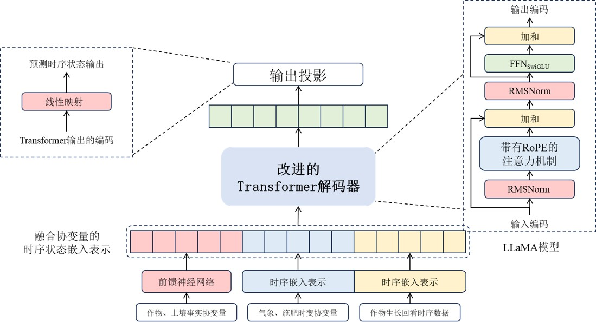
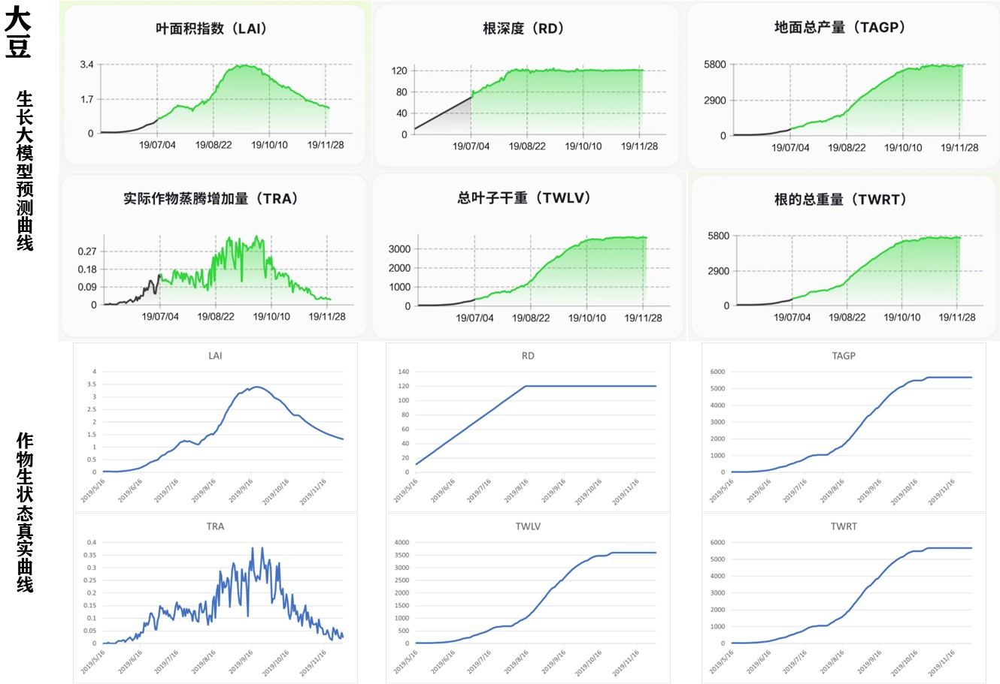
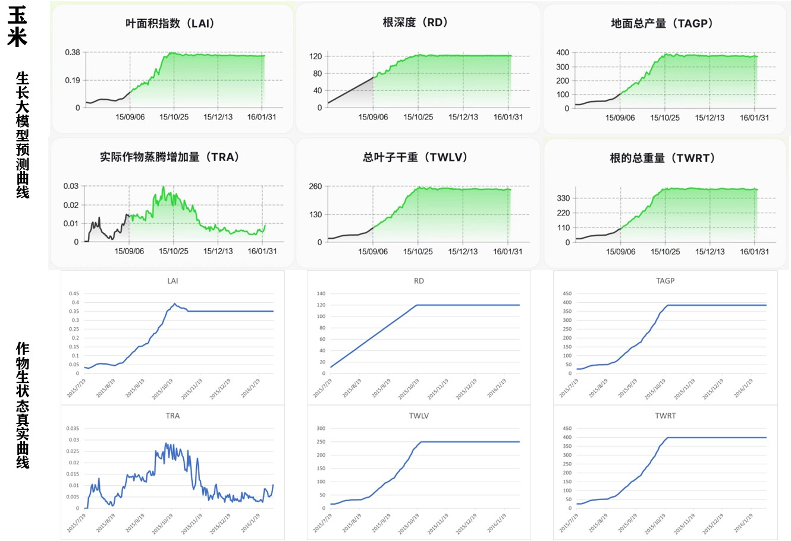
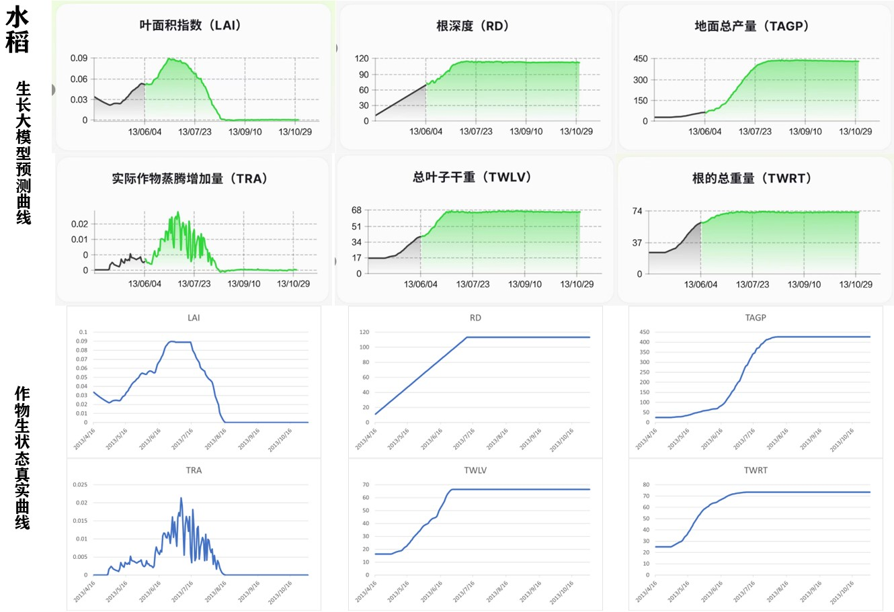
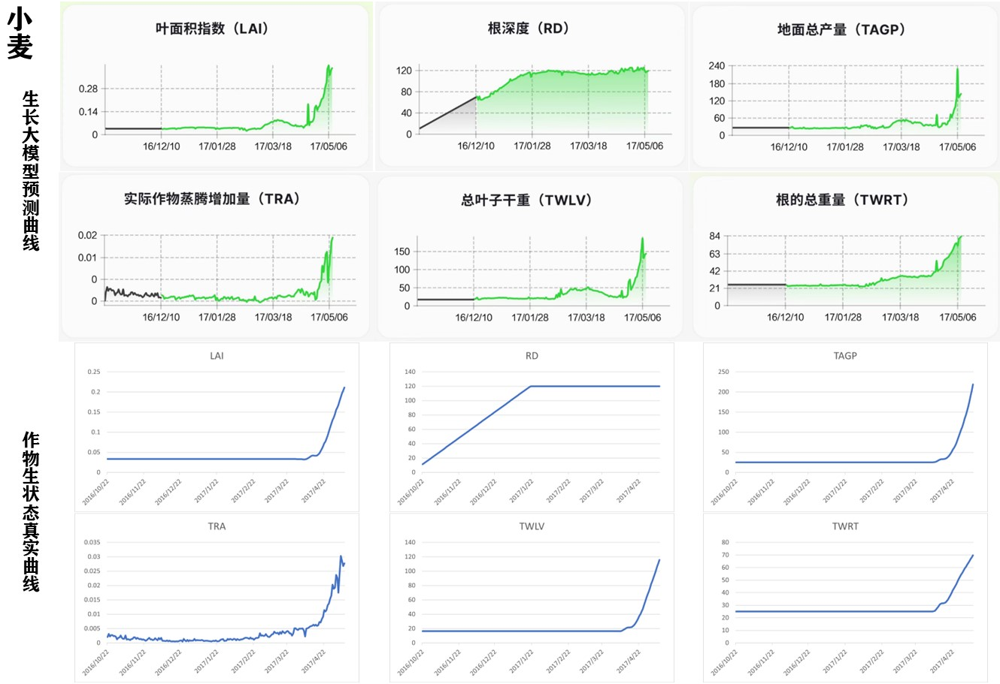

</img> 

# 天工开悟-农业生长大模型(KwooGr)
> **天工不遗，以配万物；开悟不止，以成百谷。**
## 模型简介
**天工开悟-农业生长大模型(KwooGr)** 是国内首个多类型、泛品种、跨区域的农业作物生长大模型，涵盖水稻、玉米、大豆、小麦等**22类**、**95种作物**，覆盖多种东北地区常见种植区域。通过参考作物模拟器、农学期刊、国家种植规范等农业数据源的分析，采集了各类作物共**1亿个生长周期**的生长数据，包括：叶面积指数，总产量，总叶子干重，茎、叶总重量，氮、磷、钾需求量，器官中氮、磷、钾含量等160维作物生长指标。

我们的模型展现出以下核心特性：
- 多类型：集成多种机理性作物生长模型，如**DSSAT**、**WOFOST**、**APSIM**和**Lintul3**
- 泛品种：涵盖水稻、玉米、大豆、小麦等**22类**、**95种作物**
- 跨区域：覆盖**黑吉辽**三省中的**5个农场**，集成2004至2023年共**20年**的天气情况

### 🔥🔥News

- [2024/11/20] **更新了KwooGr的APP使用教程和测试用例**，让用户能够快速上手，充分体验KwooGr在农业生产中的高效性与便捷性，推动智能农业的普及和落地。
- [2024/11/20] **推出了API访问方式**，开发者和企业用户可以轻松集成KwooGr的强大功能，全面赋能农业领域的智能化升级，助力打造准确、可泛化的智慧农业解决方案。
- [2024/11/2] 🎉🎉我们**发布了KwooGr**，是国内首个多类型、泛品种、跨区域的农业作物生长大模型，为快速育种、跨地区泛化预测提供技术支撑！支持[Web端](https://www.tgkwai.com/) 、Android端APP访问(下载APP请点击[这里](#天工开悟app-android版))。

### 数据集构建
|集成方式|集成内容|
|---|---|
|生长模型|**DSSAT**、**WOFOST**、**APSIM**、**Lintul3**|
|作物品种|水稻、玉米、大豆、小麦等**22类作物**，**共95个品种**|
|土壤环境|以肥力较高的**淤泥土**作为统一仿真土壤环境|
|种植方案|《2023 年小麦水稻玉米马铃薯春夏季科学施肥指导意见》和《2023 年黄淮海夏大豆生产技术意见》|
|种植区域|覆盖**黑吉辽**三省中的**5个农场**|
|天气数据|东北地区**5组**经纬度坐标在2004至2023年共**20年**的天气数据集成|

### 模型结构
对开源基模型LLaMA进行结构优化，通过全参训练实现作物生长状态的长距离时序预测，集成DSSAT、WOFOST、APSIM、Lintul3等传统作物生长预测功能。

### 模型使用演示

## 模型效果
在生长数据的预测上，模型具有非常高的准确率，对水稻、玉米、大豆、小麦等**22类作物**，共**95个品种**的**生长预测误差<10%**，能够帮助农民和农业专家预测作物生长全周期的表型性状。
以下是四种主要作物的预测曲线与真实曲线的对比图：
<table align="center">
    <tr>
        <td>
            
        </td>
        <td>
            
        </td>
    </tr>
    <tr>
        <td>
            
        </td>
        <td>
            
        </td>
    </tr>
</table>

## API调用模型
见[KwooGr-API使用指南](KwooGr-API使用指南.md)

## 项目参与者
本项目参与成员：[沈汝佳](https://github.com/HITshenrj)、[李舒朗]()、[林耀雄](https://github.com/Greaklin)、[黄鸿睿](https://github.com/t-lights)、[李远哲]()

指导教师：[刘劼](https://drjieliu.github.io/) 教授、[姜京池](https://homepage.hit.edu.cn/jiangjingchi) 副教授、[杨洋](https://ai.cust.edu.cn/szdw/zrjs/3f60de2fb4634ee189b2cb9ce84a2d98.htm) 副教授以及[关毅](https://homepage.hit.edu.cn/guanyi) 教授。

### 天工开悟APP (Android版)

欢迎大家扫描下方二维码下载**天工开悟APP**进行体验。

使用方法：第一步，打开APP，输入**邀请码(8t6nwq)** 进入登录页面，随后切换到“密码登录”页面输入账号、密码并勾选同意协议选项进行登录。第二步，登录后进入问答页面，在下方输入框中输入想要询问的问题，等待回答。

## 致谢
我们的项目参考了以下工作，在此表示诚挚感谢。
* [DSSAT](https://dssat.net/)
* [APSIM](https://www.apsim.info/)
* [PCSE](https://github.com/ajwdewit/pcse)
* [LlaMA](https://www.llama.com/)
* [Qwen](https://github.com/QwenLM/Qwen)